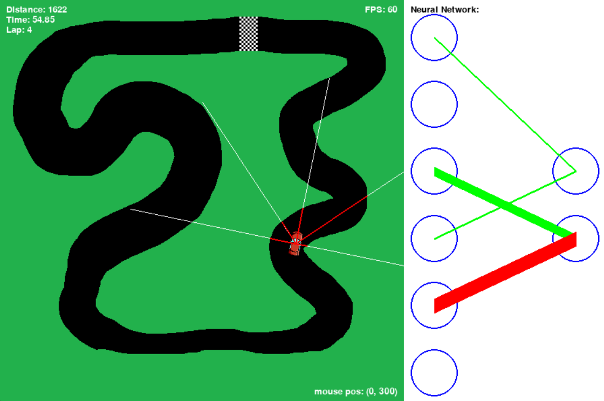

# 🏎️ NEAT Car Racing AI




This project implements a **self-driving car simulation** using the **NEAT (NeuroEvolution of Augmenting Topologies)** algorithm.  
Cars are trained to navigate a custom race track using **ray-based sensors**, evolving neural networks that learn to drive through **reinforcement**.

---

## 📂 Project Structure

```
├── ai_play.py              # Play with a trained genome (AI-controlled car)
├── ai_train.py             # Train AI agents sequentially
├── ai_train_parallel.py    # Train AI agents using parallel processing (multi-core CPUs)
├── ai_train_threads.py     # Train AI agents using threading
├── car_class.py            # Car physics & ray-based collision detection
├── config_neat.txt         # NEAT configuration file
├── main.py                 # Manual driving mode (keyboard controlled)
├── NNetworkDisplay.py      # Visualization of neural networks
├── race_track.py           # Race track, checkpoints & track creation tool
├── imgs/                   # Car & track images
│   ├── race_track.png
│   └── red_car.png
├── track_1.pickle          # Saved track with checkpoints
└── GENOMES/                # Directory for saved genomes (AI models)
```

---

## 🚀 Features

- **Manual Driving Mode** (`main.py`)  
  Drive the car yourself using the keyboard.

- **AI Training**  
  - `ai_train.py` → sequential training  
  - `ai_train_parallel.py` → multiprocessing training  
  - `ai_train_threads.py` → multithreaded training  

- **AI Playback** (`ai_play.py`)  
  Load a trained genome and watch the AI race.

- **Track Maker** (`race_track.py`)  
  Create new tracks with checkpoints interactively.

- **Neural Network Visualizer** (`NNetworkDisplay.py`)  
  Shows the AI’s brain (nodes & weighted connections) while driving.

---

## 🎮 Controls

### Manual Mode (`main.py`)
- **Z** → Accelerate  
- **S** → Brake / Reverse  
- **Q** → Steer Left  
- **D** → Steer Right  
- **M** → Show collision mask  
- **P** → Show checkpoints  
- **O** → Show car sensor rays  
- **Enter** → Restart after crash or win  

### AI Playback (`ai_play.py`)
- **M, P, O, Enter** → Same as above  
- **I** → Save current genome  

---

## 🧠 NEAT Configuration

The AI uses **NEAT-Python**, with parameters defined in `config_neat.txt`:  
- **Inputs:** Car speed + 5 ray distances (`num_inputs = 6`)  
- **Outputs:** Throttle & Steering (`num_outputs = 2`)  
- Population size: 250  
- Fitness: Based on distance traveled and checkpoints reached  

Genomes are automatically saved in the `GENOMES/` folder every few generations.

---

## ⚡ Installation

1. Clone this repo:
   ```bash
   git clone <your-repo-link>
   cd neat-car-racing
   ```

2. Install dependencies:
   ```bash
   pip install pygame neat-python numpy keyboard
   ```

3. Run a mode:
   - **Manual driving:**
     ```bash
     python main.py
     ```
   - **Train AI:**
     ```bash
     python ai_train.py
     ```
   - **Watch AI:**
     ```bash
     python ai_play.py
     ```

---

## 🛠️ Creating New Tracks
1. Run:
   ```bash
   python race_track.py
   ```
2. Place checkpoints by pressing **P** and moving the mouse.  
3. Adjust checkpoint radius with **↑/↓ keys**.  
4. Press **Esc twice** to save track as `track.pickle`.  
5. Use the new track in training/playback by updating the code.

---

## 📊 Example Workflow
1. Drive manually to test physics: `python main.py`  
2. Train AI: `python ai_train_parallel.py`  
3. Visualize trained AI: `python ai_play.py`  

---

## 📌 Requirements
- Python 3.8+  
- `pygame`  
- `neat-python`  
- `numpy`  
- `keyboard`  
